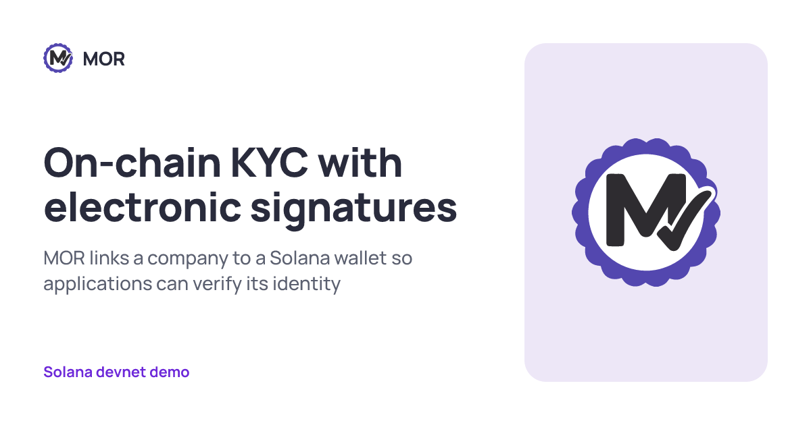
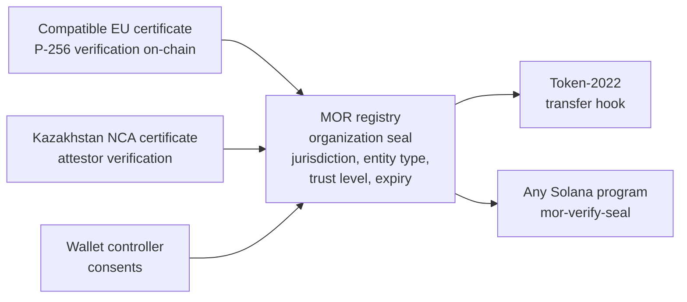

# MOR: on-chain KYC with electronic signatures

[](https://github.com/Xseron/TheMorEDS/actions/workflows/ci.yml)
[](LICENSE)
[](https://solana.com)
[](https://colosseum.org)

> MOR links a company to a Solana wallet so applications can verify its identity. The company signs with the electronic signature it already holds, any program checks the seal in one call, and no personal data goes on-chain

[Live Demo](https://morseal.ink) · [KASE Track Demo](https://morseal.ink/kase) · [Docs](docs/) · [Mor-Dividends](https://github.com/Xseron/Mor-Dividends)

---



---

## Submission to 2026 Solana National Hackathon

| Name | Role | Contact |
|------|------|---------|
| David Torossyan | Technical co-founder: cryptography and infrastructure | [Telegram](https://t.me/dtorossyan) |
| Abylaikhan Karsybayev | Product co-founder: design and customer development | [Telegram](https://t.me/ablStartup) |

---

## Problem and Solution

### 1. The wallet identity gap
- **Problem:** a Solana wallet shows its full transaction history but not the legal counterparty behind it. Company identity and wallet control need extra evidence every time
- **MOR:** the company signs a short request with its electronic signature (an NCA key in Kazakhstan, an organization certificate in the EU) and the wallet gets an on-chain organization seal

### 2. Every platform repeats onboarding
- **Problem:** each exchange, payment provider and dApp runs its own verification of business counterparties, and the result stays inside that platform
- **MOR:** the seal is a public account at `["seal", address]`. Any Solana program checks it with one call from the `mor-verify-seal` crate, no provider API involved

### 3. Rules already ask who receives a transfer
- **Problem:** the FATF Travel Rule, EU Regulation 2023/1113 and Kazakhstan's digital-assets law require providers to know the beneficiary of a transfer
- **MOR:** a Token-2022 transfer hook lets a token move only to wallets with a valid seal of the required trust level. Missing or expired seal: the transfer is rejected

### 4. Identity must not leak on-chain
- **Problem:** certificates and ID numbers on a public ledger expose the people who sign for a company
- **MOR:** a seal holds the company name and `sha256(salt || jurisdiction || BIN)`. The salt stays with the owner, and the registry doesn't record the person who signed for the company

---

## Existing Approaches and MOR

| Approach | Identity source | Application access | Main dependency |
|----------|-----------------|--------------------|-----------------|
| Licensed exchanges | Customer onboarding | Exchange integration | Licensed operator |
| KYB platforms, e.g. Sumsub | Documents and company registries | Provider API | Verification provider |
| Attestations, e.g. EAS | Issuer-defined claims | Attestation schema | Attestation issuer |
| **MOR** | Electronic signatures of organizations | Solana registry + Token-2022 hook | Trusted CAs + Kazakhstan attestor |

Reusable verification across Solana applications. The trust model stays explicit: accepted certificate authorities and attestors

---

## Why Solana

- **secp256r1 precompile (SIMD-0075):** the program verifies EU P-256 certificates and signatures on-chain, so the eIDAS path needs no trusted middleman
- **4096-byte v1 transactions:** a whole certificate fits into one transaction next to the precompile instruction
- **Token-2022 transfer hooks:** the seal check runs on every transfer of a token without wrapping it or changing wallets
- **PDAs:** a seal lives at a deterministic address, so any program finds it without an index or an off-chain lookup
- **Low fees:** checking a seal on each transfer and sealing a wallet stay cheap enough for everyday B2B payments

---

## Summary of Features

- Seal registry for wallets, programs and mints with jurisdiction, entity type, trust level and expiry
- EU path: P-256 organization certificate and signature verified on-chain, trust level `Trustless`
- Kazakhstan path: NCA signature (GOST 34.10-2015) from NCALayer checked by a Go attestor on the certified KalkanCrypt library, trust level `Attestor`
- Two-sided consent: the company signs the seal message, the wallet controller signs the transaction
- Revocation by the stored or the current controller of the address
- `mor-verify-seal` crate: one call checks the owner, expiry and minimum trust level
- Token-2022 demo token whose transfer hook admits only sealed recipients
- Website: "who stands behind this address" extract, sealing through NCALayer or a test attestor, sealed transfer demo, devnet faucet
- KASE track: corporate actions for a tokenized bond with sealed holders, program in [Mor-Dividends](https://github.com/Xseron/Mor-Dividends)

---

## Tech Stack

| Layer | Technology |
|-------|-----------|
| On-chain programs | Rust · Anchor 1.1 · Token-2022 transfer hook |
| Signature checks | secp256r1 and Ed25519 precompiles · strict DER parser for X.509 |
| Seal check for other programs | Rust crate on plain Solana crates, no Anchor |
| Kazakhstan attestor | Go 1.24 · KalkanCrypt via cgo |
| Frontend | Nuxt 4 · Vue 3 · Tailwind CSS · @solana/kit · Wallet Standard |
| Faucet and devnet scripts | Node.js · TypeScript · @solana/kit |
| Testing | LiteSVM · Go tests · Vitest · Playwright on devnet |

---

## Architecture



Valid required seal: allow. Missing or expired seal: reject

| Path | How the signature is checked | Trust level |
|------|------------------------------|-------------|
| On-chain verification | EU organization certificate, CA signature and seal signature through the secp256r1 precompile | `Trustless` |
| Attestor | Kazakhstan NCA signature checked off-chain by KalkanCrypt, the attestor signs the seal message with Ed25519 | `Attestor` |
| Zero-knowledge | Planned privacy layer | |

See [docs/architecture.md](docs/architecture.md) for the components, accounts, trust model and limits

---

## Quick Start

**Prerequisites:** Linux or WSL, Rust 1.89, Solana CLI 3.1.10, Anchor 1.1.2, Go 1.24, Node.js 20.11+, pnpm 9

```bash
# Clone the repository
git clone https://github.com/Xseron/TheMorEDS
cd TheMorEDS

# Copy environment variables (every value has a devnet default)
cp .env.example web/frontend/.env

# Build Solana programs and run their tests (LiteSVM loads the built .so files)
anchor build
cargo test -p mor_registry -p sealed_transfer -p mor-verify-seal

# Attestor tests that don't need the NCA SDK
(cd attestor && go test ./...)

# Start frontend
cd web/frontend && pnpm install && pnpm dev
```

The attestor with KalkanCrypt needs the NCA SDK, which can't be redistributed. Setup is in [docs/architecture.md](docs/architecture.md#kazakhstan-attestor-setup)

Check a seal from your own program:

```rust
let seal = mor_verify_seal::verify_seal(&seal_account, &owner, TrustLevel::Attestor)?;
// seal.jurisdiction, seal.trust_level, seal.identifier_hash, seal.expires_at
```

---

## Roadmap

- [x] Seal registry with the EU and Kazakhstan paths on devnet
- [x] `mor-verify-seal` crate and the Token-2022 demo
- [x] Kazakhstan attestor on KalkanCrypt
- [x] Website and the KASE corporate actions demo
- [ ] Complete NCALayer integration and validate with real NCA certificates
- [ ] Revocation by the organization and on certificate revocation
- [ ] Audits, security review and mainnet
- [ ] Zero-knowledge privacy layer
- [ ] Individual users and additional jurisdictions

Full roadmap: [docs/roadmap.md](docs/roadmap.md)

---

## Resources

- [Live Application](https://morseal.ink)
- [KASE Corporate Actions Demo](https://morseal.ink/kase)
- [Mor-Dividends: bond program for the KASE track](https://github.com/Xseron/Mor-Dividends)
- Telegram: [@dtorossyan](https://t.me/dtorossyan) · [@ablStartup](https://t.me/ablStartup)
