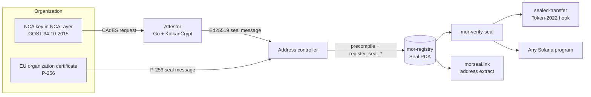
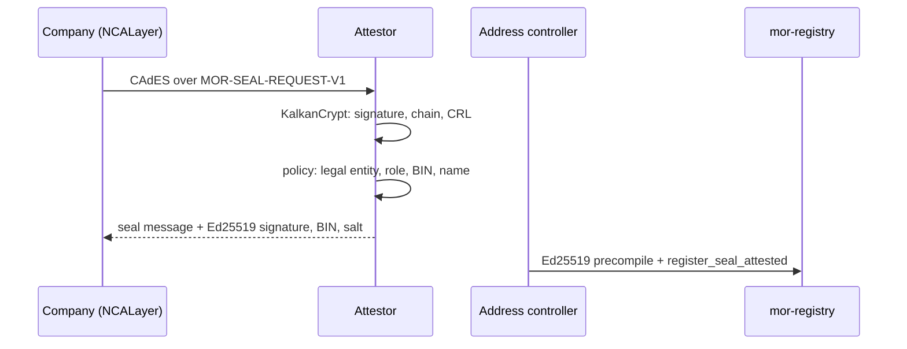

# Architecture

## System Overview

A seal ties a Solana address to a legal entity. Two parties take part: the organization signs the seal message with its certificate, and the address controller signs the transaction. The registry keeps the seal at a PDA, and any program reads it through the `mor-verify-seal` crate



## Components

### Registry program (`programs/mor-registry`)

Anchor program with four account types: `Config`, `TrustService`, `Certificate` and `Seal` (see [api.md](api.md#accounts)). Signatures are checked by the native precompiles: the program reads the previous instruction from the Instructions sysvar and accepts only a self-contained precompile instruction with one signature

- `x509.rs` is a strict DER parser for exactly the fields the registry needs: no allocations, definite minimal lengths, duplicate extensions rejected
- `register_certificate` rejects CA certificates, certificates of natural persons (surname, givenName, serialNumber or pseudonym in the subject), TLS server, timestamping and OCSP certificates, and certificates with unknown critical extensions
- A wallet seal requires a system-owned address. Program and mint seals require their upgrade or mint authority as the controller

Devnet: `CqbwC3DF4APG6cjRneir1UPuBbh49ttBrKasfc5QP1aP`

### Seal check crate (`crates/mor-verify-seal`)

Plain Solana crates, no Anchor, so any program can depend on it. It checks the account owner, the PDA, the expiry and the minimum trust level, and reads the fields at fixed offsets. A test in the registry compares those offsets with what Anchor writes

### Sealed-transfer token (`programs/sealed-transfer`)

A Token-2022 transfer hook. Each mint has a policy with the minimum trust level. The extra account metas give the hook the registry (account 5), the policy (6) and the seal of the recipient's owner (7), derived from bytes 32..64 of the destination token account. A direct call that bypasses Token-2022 is rejected because the source account isn't in the `transferring` state

Devnet: `2A8chB6zt4LCsiiks5NrY3DceHvAVqWkAmMdNpyFkhz2`

### Kazakhstan attestor (`attestor/`)

Local Go service. Kazakhstan signatures use GOST 34.10-2015 and Streebog, which Solana can't verify, so the attestor checks them off-chain and signs the seal message with Ed25519

- `request`: strict parser of the request text, any deviation is rejected
- `kalkan`: KalkanCrypt through cgo, the only code that checks the signature, the chain to the NCA root and revocation by CRL
- `policy`: reads O, OU, EKU and the validity period through `crypto/x509`. Only the first head or an employee with signing rights of a legal entity passes. CN, SN, GN and serialNumber are never read
- `seal`: builds the same seal message bytes as the Rust program
- `server`: `POST /v1/attest`, `GET /v1/info`

The return code of `VerifyData` in KalkanCrypt doesn't reflect the GOST signature value. The attestor takes the verdict from the library's own verification report (`outVerifyInfo` must say exactly `Verify - OK` for every signer) and checks the chain and revocation again with `X509ValidateCertificate(KC_USE_CRL)`. After any KalkanCrypt update run `go test -tags kalkan ./...` again: a changed report text rejects every CMS

### Website (`web/frontend`)

Nuxt 4, static build. Pages:

- `/`: landing
- `/address/<address>`: "who stands behind this address", built in the browser from the registry
- `/seal`: seal a wallet through NCALayer and the attestor, or through the test attestor in the browser
- `/transfer`: the sealed-transfer demo token
- `/kase`: corporate actions for a tokenized bond, program in [Mor-Dividends](https://github.com/Xseron/Mor-Dividends)

Wallets connect through Wallet Standard, there's also a built-in demo wallet. Every transaction is simulated before it goes to the wallet

### Faucet (`web/drip`) and devnet scripts (`scripts/devnet-v1`)

`web/drip` gives a new demo wallet 0.05 devnet SOL and 50 demo tokens. `scripts/devnet-v1` runs the whole scenario on devnet with v1 transactions: CA and certificate, seals, the token with the hook, transfers, revocation and sealing through the attestor

## Sealing Flows

### EU path, trust level `Trustless`

1. The admin adds the CA as a `TrustService`
2. Anyone registers the organization certificate: a secp256r1 precompile instruction with the CA signature over the TBS, then `register_certificate`
3. The organization signs the seal message with the certificate key. The controller sends a secp256r1 precompile instruction with that signature, then `register_seal_p256`

The identifier hash is computed on-chain from the salt and `organizationIdentifier`. Before sending, the devnet script checks that the certificate has no personal data: the TBS travels in the transaction and would stay in the ledger even if the program rejected it

### Kazakhstan path, trust level `Attestor`



## Trust Model

MOR is an attestation, but its attestor is a verifier, not an issuer. The identity comes from a state electronic signature that the company made itself

- **EU path:** nothing to trust except the CA list. The program checks the CA signature over the certificate and the certificate signature over the seal message, and both stay in the ledger, so anyone can re-check them
- **Kazakhstan path:** GOST 34.10-2015 isn't among Solana's precompiles (Ed25519, secp256k1, secp256r1), and a 512-bit curve with Streebog is too heavy for a program's compute budget, so the attestor checks it off-chain. The signed request contains the signer's name and IIN, so it isn't published: the company keeps it and can show it to an auditor or a counterparty
- **Removing the attestor:** the roadmap proves the GOST signature check in a zkVM (SP1 or RISC Zero), wraps it into Groth16 and verifies it on Solana through alt_bn128 syscalls. The attestor then becomes a relay, and the signer's certificate never leaves the company
- The list of trusted CAs is kept by the program admin, who is also the upgrade authority
- Consumers choose the minimum trust level: `Attestor` accepts both paths, `Trustless` only on-chain verified seals
- The keys in `fixtures/keys/` (test CA and test attestor) are public, so anyone can create seals with them. They are for devnet only

## Privacy

- On-chain: the company name, the jurisdiction and `sha256(salt || jurisdiction || identifier)`. The salt stays with the owner
- The registry doesn't record the person who signed for the company
- The attestor returns the salt and BIN only to the caller and doesn't store them. It never reads or logs the signer's name or IIN

## Kazakhstan Attestor Setup

Needed: Go 1.24, gcc, `sudo apt install libltdl7 libpcsclite1` and the NCA SDK (KalkanCrypt, test keys and CAs, issued by NCA of Kazakhstan at pki.gov.kz) in `pkisdk/`. The SDK isn't in the repository, the NCA license doesn't allow it

KalkanCrypt takes trusted roots only from the system store (`/etc/ssl/certs` in WSL). Install the test roots with the SDK script:

```bash
unzip -d /tmp pkisdk/C/Linux/ca-certs/ca-certs_new/test2022.zip
cd /tmp/test2022 && sudo bash install_test.sh
```

Unpack to `/tmp` so nothing from the SDK ends up in the repository. After `install_test.sh` the whole WSL distribution trusts the NCA test roots. The `--ca` files are still needed, they pin the issuer (AuthorityKeyId and DN)

```bash
cd attestor
go test ./...                 # without the SDK: request, policy, seal message
go test -tags kalkan ./...    # with the SDK: NCA test keys through KalkanCrypt
go build -tags kalkan -o bin/attestor ./cmd/attestor
cd .. && attestor/bin/attestor serve        # http://127.0.0.1:8787
```

Operations: without the test roots in the system store every request gets 401 `bad_signature`. Update the CRL file before its nextUpdate (2027-02-07 for the test CRL): KalkanCrypt rejects an expired CRL and every request gets 500

## Limits

- Only the address controller can revoke a seal, the organization can't yet
- A program whose upgrade authority is a multisig, and a program or mint without an authority, can't be sealed
- A change of the program or mint owner doesn't remove the seal, the new controller revokes it
- The attestor checks NCA revocation by CRL at sealing time. A certificate revoked later doesn't remove the seal. OCSP isn't used, and the EU path checks neither OCSP nor CRL
- A seal is valid until `expires_at`, which is at most the end of the certificate (EU) or of the signer certificate (attestor). NCA certificates last about a year, so a company re-seals at least once a year
- A signature proves who signed, not that the company is still active. Checks against the state business register are planned
- The Token-2022 hook works only for tokens created with the extension: SOL, USDC and most existing tokens aren't affected. Some wallets and DEXes handle hooks poorly, and a hook adds accounts and compute to each transfer. Other programs read the registry directly

## Repository Layout

```
programs/mor-registry     registry program
programs/sealed-transfer  Token-2022 transfer hook demo
crates/mor-verify-seal    seal check for other programs
attestor/                 Kazakhstan attestor (Go)
web/frontend/             website (Nuxt)
web/drip/                 devnet faucet
scripts/devnet-v1/        devnet scenario scripts
fixtures/                 test CA, certificates and keys (gen.sh)
```
